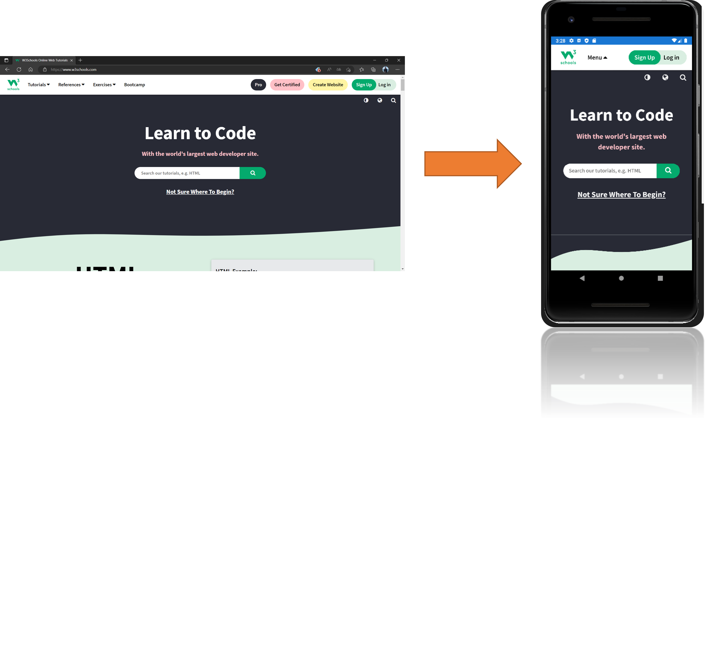

# Xamarin Project
The purpose of this project is to convert a website into an Android and iOS application.

You can convert your website by changing the `url` variable found in the `App5/App5/App.xaml.cs` file.

Here is an example with the [W3school](https://www.w3schools.com/) website:

    

 
